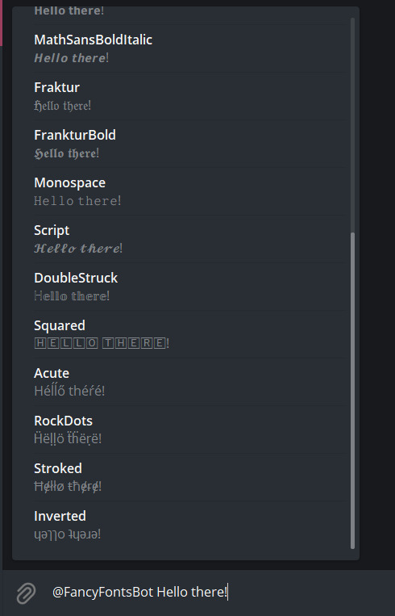
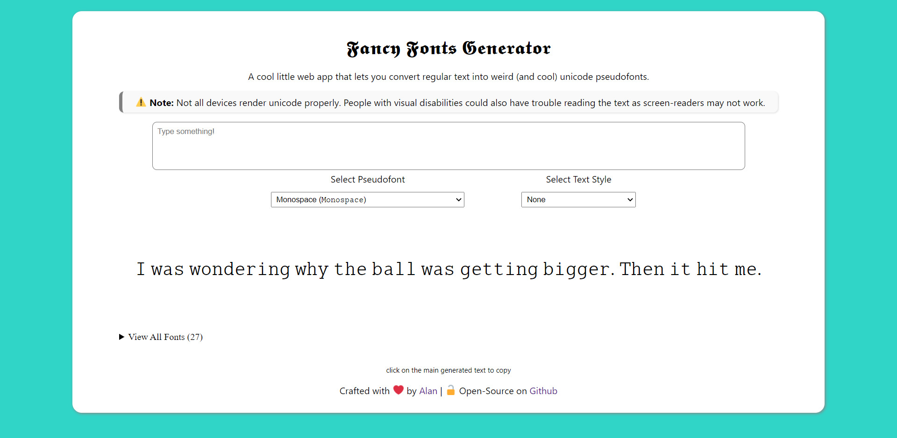

+++
title = "Creating pseudofonts using unicode characters."
date = 2021-03-11
+++

Quite a long time ago, I came across this nifty little website called [qaz.wtf](https://qaz.wtf/u/convert.cgi). It had a tool where you could input a text and it would give you back the same text but in various different fonts (sans-serif, serif, monospace, etc...). These fonts retained its style even if you copied it and pasted it elsewhere like on an online thread or a chat. 

Thanks to the unicode character set and the thousands of special and unique characters it provides, and the fact that most modern day applications (including chat apps) and devices support it. It's possible to group similar characters together to create makeshift fonts to replace the default English alphabets. We can then use these pseudofonts (that's what I like to call them because they are well, fake-fonts) pretty much anywhere with unicode support. 𝓗𝓮𝓻𝓮'𝓼 𝓪𝓷 𝓮𝔁𝓪𝓶𝓹𝓵𝓮 𝓸𝓯 𝓽𝓮𝔁𝓽 𝓶𝓪𝓭𝓮 𝓾𝓼𝓲𝓷𝓰 𝓪 𝓼𝓮𝓽 𝓸𝓯 𝓾𝓷𝓲𝓬𝓸𝓭𝓮 𝓬𝓱𝓪𝓻𝓪𝓬𝓽𝓮𝓻𝓼.

I frequently wrote text this way in chats and forums where I enjoyed seeing people's reactions of confusion as not many people knew that this was a possibility at the time. I eventually stopped using it and forgot about it.

Until recently of course... when I saw someone in a Discord server I was in typing in a weird font. I immediately knew this was one of those unicode fonts that I used to play with years ago and mentioned them about it. They did not know about qaz.wtf but told me that they were using a keyboard app that lets you type with various fonts and showed me a couple of fonts that I hadn't seen before. I was amazed for a second because putting these fonts in a keyboard app is such a neat idea that I hadn't thought about before. It's so much more convenient and quick to type using these fonts that way.

I wanted to try creating my own pseudofonts by mixing various unicode characters together. Of course, doing this by hand would be painstaking as I would have to keep a list of all the replacement characters and construct sentences letter-by-letter by copy pasting them. I tried to find a unicode font builder that could automate this but I could not find one either because I'm bad at googling or there wasn't one. So let's make our own!

### Enter, the pseudofont module.

Using Python, I quickly wrote something up that takes in replacement symbols for all the alphabets and creates a generator using those characters.

{{ gist(url="https://gist.github.com/waterrmalann/0f8b400bf64b0412ac895ad9fcf8f3e8") }}

If you can find a string of consistent, legible, and convincing looking unicode replacement characters for all 26 letters of the English alphabet, you can create your own unicode pseudofont with this simple system.

Of course, we need to define fonts this way for it to work. So I went ahead and did the time consuming task of ripping all the cool fonts from qaz.wtf and arranging them in the syntax that the pseudofont class supports, and put them in a [JSON file](https://github.com/waterrmalann/telegram-fancy-fonts-bot/blob/main/fonts/fonts.json). This JSON file can then be opened programatically and looped through, defining all the fonts in it in the process.

### As a telegram bot.

Obviously converting text using a command line utility is inconvenient and slow. I mostly use Telegram for conversations and recently having been made a bot for [Chat Games](https://waterrmalann.github.io/blog/conversational-games-bot), I figured it would be a cool idea to make a bot to spit out these pseudofonts. Telegram bots can work "inline" where it can be evoked by mentioning it's username and selecting from a set of options the bot gives you which is super quick and way better than adding it to a group and issuing commands. Furthermore, this system also works inside DMs. 

Here's the result!

As soon as you mention the bot in any chat and type a message, it'll show a list of all the available fonts that you can pick from.

And here’s how it looks like!

I’m not hosting it 24x7 but I may in the future. The Telegram username for my instance is [@FancyFontsBot](https://telegram.me/FancyFontsBot). You can check out the [source code for the bot](https://github.com/waterrmalann/telegram-fancy-fonts-bot) on my GitHub.

### As a web app.

#### [Appended 2021-08-07]

Few months pass, boredom gives me yet another idea. To add even more fonts and turn this into a web app because why not! I then set out to develop a single page web application in HTML, CSS, and vanilla JavaScript. This also meant I had to rewrite the Pseudofont class in JavaScript but it was a relatively simple script so converting it should be a trivial task. 

*Sigh, it was not.* 

Unlike Python, JavaScript does not handle surrogate pairs (a combination of two unicode characters to form a single character) and treats them individually. A lot of unicode characters in these custom fonts relied on surrogate pairing so it had to be accounted for. I did not know this and it took me an entire evening to come to this realization. After spending a lot of time in various corners of the Internet, I managed to get it working.

I made it so that it is cross-compatible with the same JSON file with all the font definitions I made for the Telegram bot.

Here's how it looks like. Being a web app, it is also cross-platform by default and responsive on all devices. 
**Bonus:** It generates a random pun when you provide it with no input, so the web app also doubles as a pun generator hehe

This one is also open-source and licensed under the permissive MIT license.

- 🔗 [Source Code | Github](https://github.com/waterrmalann/fancy-fonts-generator)
- 🔗 [Live Demo](https://waterrmalann.github.io/fancy-fonts-generator/)

### But of course, it comes with it's negatives.

Playing with unicode pseudofonts is fun but it can quickly get annoying and difficult to read (especially some fonts). They are also bad for accessibility as screen readers can't always read them properly if the reader has some visual disability. So, use it with caution and don't use it for important stuff and especially avoid over using it. Just use it to have fun with :D

And that's it! I hope you can find creative ways to use these fonts and maybe even create your own. Be sure to share it with me if you manage to do something cool with it! 😄