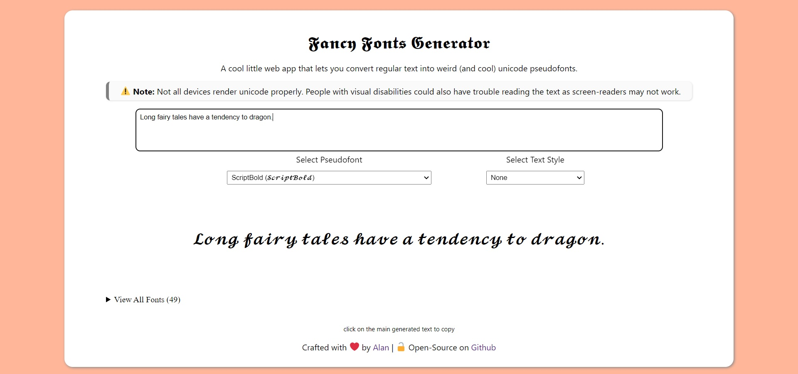

+++
title = "Fancy Fonts Generator"
date = 2021-08-07
description = "A web app to convert inputted text into unicode pseudofonts."
+++

A super-simple web app that you can use to generate cool, weird, and beautiful text using pseudofonts made with Unicode characters. This is the GUI-based equivalent of the [Fancy Fonts Bot](https://github.com/waterrmalann/telegram-fancy-fonts-bot) for Telegram that I wrote not too long ago. They are both similar in terms of functionality and the font system is cross-compatible. It's written in HTML, CSS, and vanilla Javascript with no dependencies.

It uses a system of pseudofonts where similar looking strings of unicode symbols are used to replace the entire english alphabet to create a fake font. I've described it in detail [in this article](@/blog/unicode-pseudofonts/index.md).

**Note:** *Text generated using this application may not always be readable, they could also cause accessibility issues as screen-readers might not recognize them. So it is advised that you use them knowing the downsides.*

> 𝕿𝖍𝖎𝖘 𝖕𝖆𝖗𝖆𝖌𝖗𝖆𝖕𝖍 𝖔𝖋 𝖙𝖊𝖝𝖙 𝖜𝖆𝖘 𝖌𝖊𝖓𝖊𝖗𝖆𝖙𝖊𝖉 𝖚𝖘𝖎𝖓𝖌 𝖙𝖍𝖊 𝖜𝖊𝖇 𝖆𝖕𝖕.
> 
> 𝓘𝓽 𝓾𝓼𝓮𝓼 𝓼𝓸𝓶𝓮 𝓸𝓯 𝓽𝓱𝓮 𝓭𝓲𝓯𝓯𝓮𝓻𝓮𝓷𝓽 𝓯𝓸𝓷𝓽𝓼 𝓽𝓱𝓪𝓽 𝓪𝓻𝓮 𝓪𝓿𝓪𝓲𝓵𝓪𝓫𝓵𝓮 𝓫𝔂 𝓭𝓮𝓯𝓪𝓾𝓵𝓽.
> 
> 𝕋𝕙𝕚𝕤 𝕜𝕚𝕟𝕕 𝕠𝕗 𝕥𝕖𝕩𝕥 𝕔𝕒𝕟 𝕓𝕖 𝕔𝕠𝕡𝕚𝕖𝕕 𝕒𝕟𝕕 𝕡𝕒𝕤𝕥𝕖𝕕 𝕒𝕟𝕪𝕨𝕙𝕖𝕣𝕖.
> 
> 𝑻𝒉𝒆𝒚 𝒘𝒊𝒍𝒍 𝒔𝒕𝒊𝒍𝒍 𝒓𝒆𝒕𝒂𝒊𝒏 𝒕𝒉𝒆𝒊𝒓 𝒐𝒓𝒊𝒈𝒊𝒏𝒂𝒍 𝒍𝒐𝒐𝒌 𝒂𝒔 𝒍𝒐𝒏𝒈 𝒂𝒔 𝒕𝒉𝒆 𝒑𝒍𝒂𝒕𝒇𝒐𝒓𝒎 𝒔𝒖𝒑𝒑𝒐𝒓𝒕𝒔 𝒖𝒏𝒊𝒄𝒐𝒅𝒆.
> 
> 𝚃𝚑𝚎𝚢 𝚖𝚒𝚐𝚑𝚝 𝚜𝚘𝚖𝚎𝚝𝚒𝚖𝚎𝚜 𝚋𝚎 𝚍𝚒𝚏𝚏𝚒𝚌𝚞𝚕𝚝 𝚝𝚘 𝚛𝚎𝚊𝚍 𝚑𝚘𝚠𝚎𝚟𝚎𝚛, 𝚊𝚗𝚍 𝚌𝚊𝚞𝚜𝚎 𝚊𝚌𝚌𝚎𝚜𝚜𝚒𝚋𝚒𝚕𝚒𝚝𝚢 𝚒𝚜𝚜𝚞𝚎𝚜.
> 
> Ｓｏ Ｉ'ｄ ｒｅｃｏｍｍｅｎｄ ｎｏｔ ｕｓｉｎｇ ｉｔ ｆｏｒ ｉｍｐｏｒｔａｎｔ ｔｅｘｔ.
> 
> 🅞🅝🅛🅨 🅤🅢🅔 🅘🅣 🅣🅞 🅗🅐🅥🅔 🅕🅤🅝!

#### Features

- Real-time text to pseudofont conversion.
- 50+ unique fonts pre-defined.
- Simple syntax for adding custom fonts.
- Can double as a pun generator. 😛
- Ability to convert all loaded fonts at the same time.

### Links

The web app is open-source, MIT licensed, and available on my Github. A live version is also available to play with.

- 🔗 [**Live Demo**](https://waterrmalann.github.io/fancy-fonts-generator)
- 🔗 [**Source Code**](https://github.com/waterrmalann/fancy-fonts-generator)