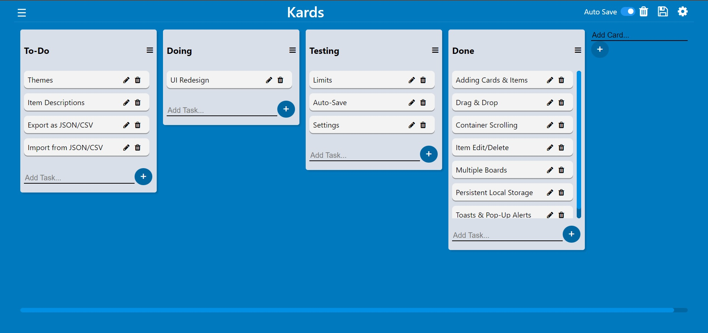

+++
title = "Kards"
date = 2021-09-13
description = "A simple kanban board implementation heavily inspired by Trello in vanilla JS."
+++

Kards is an implementation of the kanban board method of task management and prioritization as a web app built with pure vanilla Javascript and zero external dependencies. It is heavily inspired by and similar in terms of functionality with Trello but does not try to be a clone. You can create upto 512 unique kanban boards with different names, which holds cards. Each card can hold an unlimited number of items/tasks each. All items support drag and drop between cards as well as within the same card to reoder. All data is stored locally on the computer by the browser. This whole project was written in HTML, CSS, and pure vanilla JavaScript with no external dependencies.

It is however not a full fledged implementation and lacks several features when compared to other kanban board apps. I developed it as sort of an experiment to see if such a complex application could be effectively built using vanilla Javascript with no frameworks and I was genuinely impressed with the results. That does have it's disadvantages though, as the code is not modular and got quite difficult to maintain as more features were added.

I do still believe that vanilla Javascript can be used to create complex web apps if done the right way. I've learnt a lot from working on this and I plan to archive this project in the near future and start a rewrite with the same constraints but take a different approach, taking full advantage of modern Javascript language features and the things I have learnt along the way. 

### Links

The web app is open-source, MIT licensed, and available on my Github. A live version is also available for you to test it out.

- 🔗 [**Live Demo**](https://waterrmalann.github.io/kards)
- 🔗 [**Source Code**](https://github.com/waterrmalann/kards)