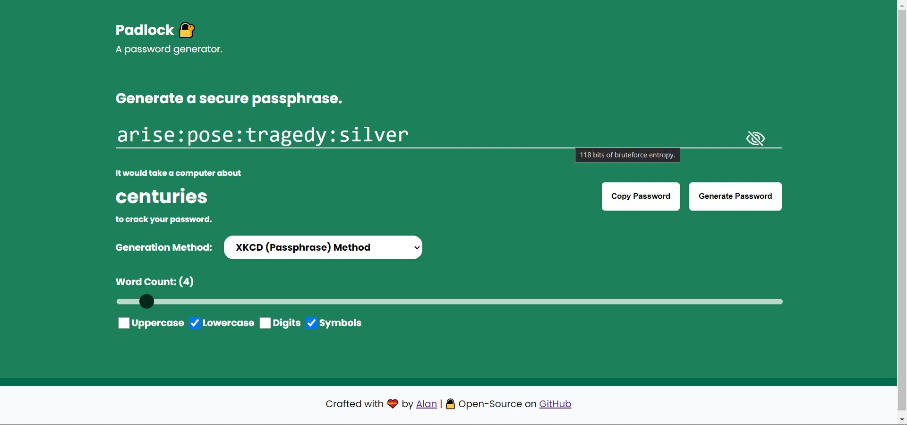

+++
title = "Padlock"
date = 2022-02-26
description = "A sophisticated password generator and strength checker."
+++

Padlock is single page web application that lets you generate strong and secure passwords as well as check the strength of your existing ones measured in an interesting way of how long it would theoretically take for a malicious individual to crack it. The tool runs locally in your web browser and no information is ever sent to any servers.

Padlock has 4 different password generators that uses various approaches to create extremely strong passwords. You can pick your favourite generator all of which are guaranteed to generate cryptographically secure, unique password combinations under optimal conditions. This whole project was written in HTML, CSS, and vanilla JavaScript with a few dependencies.

The idea of measuring password strength this way was inspired by this web app from [security.org](https://www.security.org/how-secure-is-my-password/). A popular implementation of this type of strength estimation is the [zxcvbn](https://github.com/dropbox/zxcvbn) library by Dropbox which Padlock uses.

#### Available Generators

- **Random String Method:** Generates a completely random string based the parameters provided via the checkboxes and length based on the slider. Usually extremely strong, however not so easy to remember.
- **Pseudoword Method:** A method that attempts to generate pronouncable and easy to read passwords. The pronouncability makes it much more easier to remember than a random string. 
- **Passphrase Method:** A passphrase generator inspired by [this XKCD comic](https://xkcd.com/936/). A long string of words from a Dictionary are generated, making it easy to remember but extremely difficult to crack.
- **Pseudoword + Passphrase Method:** A passphrase generator that uses pseudowords instead of real words. Perhaps the strongest generator as the generated passwords are long with words not present in any dictionary.

### Links

The web app is open-source, MIT licensed, and available on my Github. A live version is also available to play with.

- 🔗 [**Live Demo**](https://waterrmalann.github.io/padlock)
- 🔗 [**Source Code**](https://github.com/waterrmalann/padlock)